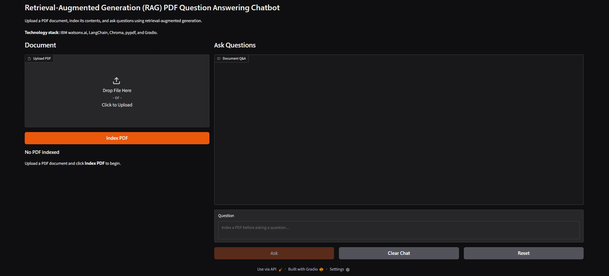
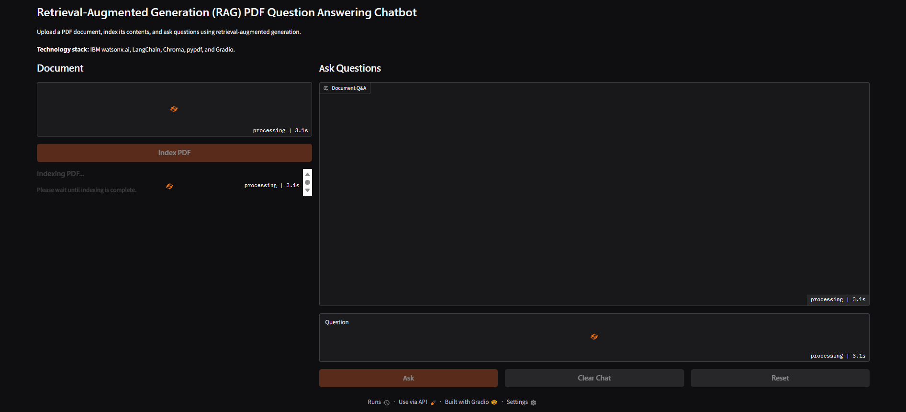
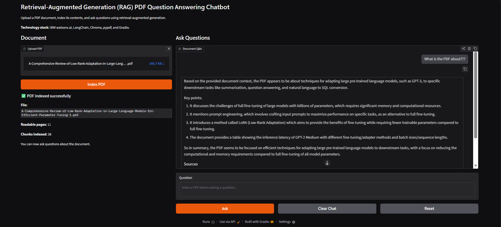

# Retrieval-Augmented Generation (RAG) PDF Question Answering Chatbot

A portfolio project that demonstrates two implementations of the same PDF question-answering workflow:

- **IBM watsonx.ai + IBM Granite** for cloud-hosted embeddings and answer generation
- **Meta Llama + Ollama** for fully local embeddings and answer generation

Both versions use **LangChain**, **Chroma**, **pypdf**, and **Gradio** to extract PDF text, split it into chunks, retrieve relevant passages, generate grounded answers, and display the source pages used for each response.

> **AI Accuracy Disclaimer:** The IBM Granite and Meta Llama models used by this project can make mistakes, misinterpret retrieved passages, omit important context, or generate inaccurate information. Retrieval-Augmented Generation reduces but does not eliminate these risks. Always verify important answers against the cited PDF pages and original source document, especially before relying on the output for medical, legal, financial, academic, safety-critical, or other high-stakes decisions.

## Features

- Upload and index readable PDF documents
- Extract text with pypdf
- Split text into overlapping chunks
- Store vector embeddings in Chroma
- Retrieve relevant passages with semantic similarity search
- Generate answers grounded only in retrieved PDF context
- Display source pages used for each answer
- Replace the previously indexed PDF when a new document is indexed
- Clear chat history without removing the indexed document
- Reset the application state
- Disable conflicting controls during indexing and answer generation
- Serialize resource-intensive RAG operations to avoid race conditions
- Provide user-friendly error handling

The local Llama implementation also includes query-aware retrieval for broad questions such as document summaries, purpose, overview, and main topic. For those questions it expands retrieval and prioritizes introductory context so smaller local models receive high-value passages from the beginning of the document.

## Implementations

### IBM watsonx.ai version

Repository root:

```text
app.py
rag_pipeline.py
requirements.txt
.env.example
```

Models:

```text
Embedding: ibm/granite-embedding-278m-multilingual
Chat:      ibm/granite-4-h-small
```

This version requires an IBM watsonx.ai project, IBM Cloud API key, and project ID.

### Local Llama + Ollama version

Directory:

```text
llama/
├── app_llama.py
├── rag_pipeline_llama.py
├── requirements-llama.txt
└── README.md
```

Models:

```text
Embedding: embeddinggemma
Chat:      llama3.2
```

This version runs through a local Ollama service and does not require IBM Cloud credentials. See [`llama/README.md`](llama/README.md) for installation, GPU troubleshooting, and local execution details.

## RAG Workflow

Both implementations follow the same core architecture:

```text
PDF Upload
    |
    v
PDF Text Extraction
    |
    v
Text Chunking
    |
    v
Vector Embeddings
    |
    v
Chroma Vector Database
    |
    v
Semantic Retrieval
    |
    v
Relevant PDF Context
    |
    v
LLM Answer Generation
    |
    v
Grounded Answer + Source Pages
```

## Project Structure

```text
rag-pdf-qa-chatbot/
├── app.py
├── rag_pipeline.py
├── requirements.txt
├── README.md
├── .env.example
├── .gitignore
├── llama/
│   ├── app_llama.py
│   ├── rag_pipeline_llama.py
│   ├── requirements-llama.txt
│   └── README.md
├── screenshots/
└── tests/
    └── README.md
```

No third-party sample PDF is bundled with the repository. Test PDFs should remain local and are ignored through `.gitignore` when placed under `sample_docs/`.

## Requirements

- Python 3.11
- A readable text-based PDF
- Chroma
- LangChain
- Gradio
- pypdf

For the IBM version, you also need access to IBM watsonx.ai.

For the local version, you also need Ollama with the configured models downloaded.

## Clone the Repository

```bash
git clone https://github.com/ToddString/IBM-rag-pdf-qa-chatbot.git
cd IBM-rag-pdf-qa-chatbot
```

## IBM watsonx.ai Installation

Create and activate a virtual environment:

```bash
python3 -m venv .venv
source .venv/bin/activate
```

Windows PowerShell:

```powershell
python -m venv .venv
.venv\Scripts\Activate.ps1
```

Install dependencies:

```bash
pip install -r requirements.txt
```

Copy the example environment file:

```bash
cp .env.example .env
```

Configure:

```env
WATSONX_APIKEY=your_ibm_cloud_api_key
WATSONX_PROJECT_ID=your_watsonx_project_id
WATSONX_URL=https://us-south.ml.cloud.ibm.com
```

Do not commit the real `.env` file or IBM Cloud credentials.

Run the Gradio application:

```bash
python app.py
```

Then open the local URL shown by Gradio, normally:

```text
http://127.0.0.1:7860
```

## Local Llama + Ollama Installation

Install and run Ollama, then download the configured models:

```bash
ollama pull llama3.2
ollama pull embeddinggemma
```

Create a virtual environment and install the local dependencies:

```bash
python3 -m venv .venv-llama
source .venv-llama/bin/activate
pip install -r llama/requirements-llama.txt
```

Run the local Gradio application:

```bash
python llama/app_llama.py
```

Run the local command-line pipeline with your own PDF:

```bash
python llama/rag_pipeline_llama.py /path/to/document.pdf "What is this document about?"
```

For GPU verification and Ollama troubleshooting, see [`llama/README.md`](llama/README.md).

## Using the Applications

1. Launch either the IBM or local Llama Gradio application.
2. Upload a readable PDF.
3. Click **Index PDF**.
4. Wait for indexing to complete.
5. Enter a question about the document.
6. Click **Ask** or press Enter.
7. Review the generated answer and listed source pages.

A newly indexed PDF replaces the previously indexed document.

## Local Llama Broad-Question Retrieval

The Llama implementation distinguishes between specific questions and broad document questions.

Specific questions use the normal similarity retriever.

Broad questions containing terms such as `summarize`, `purpose`, `overview`, `main topic`, or equivalent document-level phrasing trigger expanded retrieval. The pipeline combines:

- introductory-page retrieval
- the original user query
- an overview-oriented retrieval query

The retrieved chunks are deduplicated and introductory context is placed first before generation. This improves answers to questions such as:

```text
What is the purpose of this PDF?
Summarize this article.
What is this document about?
```

## Error Handling

The IBM implementation handles common failures including:

- missing PDF files
- unsupported file types
- PDFs with no readable text
- missing watsonx.ai environment variables
- IBM API failures
- IBM token quota exhaustion
- questions submitted before indexing
- blank questions

The local implementation handles similar input and state errors and also reports a friendly message when Ollama is unavailable or a configured local model is missing.

Technical details remain available in terminal logs for troubleshooting.

## Concurrency and Application State

Indexing and answer generation are serialized through the Gradio event queue.

Interactive controls are disabled while resource-intensive RAG operations run. This prevents conflicting actions such as asking a question while indexing is still in progress or resetting the application during an active request.

## Vector Database Behavior

Each implementation uses its own persistent Chroma database directory.

When a new document is indexed, the existing contents for that implementation are reset before the new document is stored. The project therefore operates as a single-document question-answering system rather than a multi-document knowledge base.

Chroma database files are excluded from Git.

## Retrieval Defaults

Core defaults include:

```text
Chunk size:          1000 characters
Chunk overlap:       200 characters
Embedding batch:     8 chunks
Specific retrieval:  3 chunks
```

The Llama version expands retrieval to six deduplicated chunks for broad document-level questions.

## Privacy and Deployment Characteristics

### IBM watsonx.ai

PDF content used for embeddings and generation is sent to the configured IBM watsonx.ai service. This implementation demonstrates cloud AI integration and requires valid IBM credentials and available service quota.

### Local Llama + Ollama

When Ollama is running locally, PDF text, embeddings, retrieval, and answer generation remain on the local machine. Performance depends on available CPU, RAM, GPU resources, model loading time, and PDF size.

## Screenshots

### IBM Application Interface



### IBM PDF Indexed



### IBM Question Answering with Sources



Additional screenshots for the local implementation can be added under `screenshots/llama/`.

## Security

Never commit credentials, virtual environments, vector databases, or test documents containing sensitive information.

Important ignored paths include:

```text
.env
.venv/
venv/
env/
chroma_db/
sample_docs/*.pdf
__pycache__/
```

Before publishing changes, verify ignored files with:

```bash
git status --short --ignored
```

## Current Limitations

- PDFs must contain extractable text
- Scanned image-only PDFs are not OCR processed
- Only one PDF is indexed at a time per implementation
- Answer quality depends on retrieval quality and document content
- AI-generated answers can still be inaccurate even when source passages are retrieved
- Large PDFs require more indexing time and compute
- IBM usage depends on service availability and token quota
- Local Llama performance depends heavily on available hardware and whether Ollama uses CPU or GPU acceleration
- Local model responses can differ from IBM Granite responses

## Dependencies

IBM implementation:

```text
chromadb==1.5.9
gradio==6.24.0
ibm-watsonx-ai==1.6.3
langchain-chroma==1.1.0
langchain-core==1.5.5
langchain-ibm==1.1.0
langchain-text-splitters==1.1.2
pypdf==6.16.1
python-dotenv==1.2.2
```

Local Llama implementation:

```text
chromadb==1.5.9
gradio==6.24.0
langchain-chroma==1.1.0
langchain-core==1.5.5
langchain-ollama==1.1.0
langchain-text-splitters==1.1.2
pypdf==6.16.1
```

## Project Background

This project began as an IBM Skills Network learning exercise covering document loading, text splitting, embeddings, vector databases, retrieval, language models, and Gradio.

The IBM version was rebuilt and expanded into a standalone portfolio implementation with updated watsonx.ai and LangChain integrations, modern Chroma usage, persistent vector storage, batched embeddings, source-page reporting, application-state management, concurrency protection, improved error handling, and a redesigned Gradio interface.

A second implementation was then added using Meta Llama and Ollama to demonstrate the same RAG architecture with a local model backend, local embeddings, hardware-aware execution, PDF text sanitization, and query-aware retrieval for broad document questions.

## Testing

Manual end-to-end validation is documented in [`tests/README.md`](tests/README.md).

The project does not currently include an automated unit or integration test suite.

## License

No license has been selected yet.

<<<<<<< HEAD
Before redistributing third-party documents, verify that their licenses permit inclusion. No third-party sample PDF is bundled with this repository.
=======
Before redistributing third-party sample documents, verify that their licenses permit inclusion in this repository.

## Author

**Todd Stringfellow**

B.S. Information Technology  
Digital Forensics Concentration  
Minor in Computer Information Systems  
University of South Alabama
>>>>>>> origin/main
